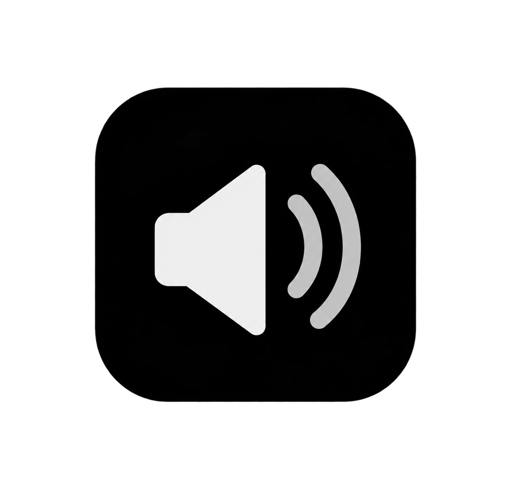

<p align="center">
  
</p>

<h1 align="center">FineVolume</h1>

<p align="center">
  <strong>Pixel-Fidelity Android 17 Volume Panel with 120-Step Ultra-Fine Precision</strong>
</p>

<p align="center">
  
  
  
  
  
</p>

---

## 🌟 Overview

By default, Android hardcodes media volume into a coarse **15 steps**, often leaving you stuck between *"a bit too quiet"* and *"painfully loud"*.

**FineVolume** replaces your phone's native volume panel with an ultra-responsive, pixel-accurate **Android 17 / Pixel SystemUI volume slider** powered by a Shizuku high-precision audio proxy that unlocks **120 granular volume levels**.

Wrapped in pure **Jetpack Compose**, FineVolume features modern rectangular squircle geometry, a prominent divider handle, fluid spring animations, zero background dimming, and seamless hardware key repeat.

---

## ✨ Key Features

### 🎚️ 120-Step Granular Precision
- **Bypass OS Limitations**: Increases media volume granularity from 15 coarse notches to **120 micro-steps** for perfect acoustic tuning with headphones, IEMs, and Bluetooth speakers.
- **Cubic Perceptual Taper ($x^3$)**: Logarithmic volume curve modeled after the human ear's sensitivity, ensuring changes feel linear and natural at low, medium, and high volumes.

### 🎨 Pixel / Android 17 Material You Design
- **Modern Rectangular Squircle**: Clean, contemporary squircle geometry (`18dp` outer container, `14dp` slider tracks) instead of outdated circular stadium pills.
- **Prominent Divider Bar**: Distinct `5.5dp` horizontal indicator bar with smooth capsule rounding, dividing active and inactive volume tracks.
- **Edge-Optimized Geometry**: Engineered with vertical clearance so the divider bar **never shrinks, clips, or deforms** at minimum ($0\%$) or maximum ($100\%$) volume.
- **Dynamic Color Support**: Seamlessly adapts to your system wallpaper with Material You dynamic color schemes in light and dark modes.

### 📱 Dual-State Interactive Overlays

#### 1. Collapsed Right-Edge Overlay
- **Quick Ringer Mode Toggle**: Cycle between **Normal**, **Vibrate**, and **Silent (Mute)** with a single tap.
- **Vertical 120-Step Media Slider**: Drag directly with sub-pixel precision or adjust via hardware keys.
- **Live Caption Quick Toggle**: Instant toggle with system state synchronization.
- **Expand / Tune Button**: Opens the full multi-stream panel with a fluid spring animation.

#### 2. Expanded Multi-Stream Dialog
- **Zero Background Dimming**: 100% transparent backdrop—never grays out your wallpaper or active app.
- **All System Audio Streams**:
  - 🎵 **Media** (with granular stepping)
  - 📞 **Voice Call**
  - 🔔 **Ring**
  - 💬 **Notifications** (with intuitive mute warnings)
  - ⏰ **Alarm**
- **Live Caption Center Pill**: Dedicated system accessibility control.
- **System Sound Shortcut & Done Button**: Quick access to device sound settings, with automatic dismissal directly back to your screen when finished.

### 🎵 Per-App Volume Control
- **Independent App Sliders**: Automatically detects running audio apps (Spotify, YouTube, Chrome, VLC, YouTube Music, Games, etc.) and provides individual volume sliders inside the expanded panel.
- **Deep Shizuku Audio Hook**: Attenuates audio sessions directly at the Android audio framework level without requiring root.
- **Real-Time Playback Tracking**: Accurately tracks when apps start, pause, or finish playback.

### ⏸️ Pause Mode & Security Compatibility
- **One-Tap Quick Pause**: Temporarily pause FineVolume with one switch in Settings whenever you need to bypass banking or security apps that block third-party accessibility services.
- **Geto Integration**: Compatible with [GETO](https://github.com/T31n/Geto) to automate per-app accessibility toggling via Shizuku.

### ⌨️ Physical Volume Button Engine
- **Single Press**: Steps exactly 1 FineVolume increment.
- **Smooth Long Press**: Continuous, rapid volume transitions with automatic repeat loops.
- **Zero OEM Clashing**: Native volume dialog is cleanly superseded by FineVolume's accessibility overlay.

---

## 🏗️ Architecture

```
┌────────────────────────────────────────────────────────┐
│                   FineVolume System                    │
└────────────────────────────────────────────────────────┘
                           │
         ┌─────────────────┴─────────────────┐
         ▼                                   ▼
┌────────────────────────┐         ┌────────────────────────┐
│ Accessibility Service  │         │   Shizuku Proxy Core   │
│ - Hardware Key Filter  │         │ - IPlayer Binder Hook  │
│ - Hold-to-Repeat Loop  │         │ - Cubic Interpolation  │
└────────────────────────┘         └────────────────────────┘
         │                                   │
         └─────────────────┬─────────────────┘
                           ▼
┌────────────────────────────────────────────────────────┐
│               VolumeOverlayController                  │
│ - WindowManager Overlay (TYPE_ACCESSIBILITY_OVERLAY)   │
│ - Pure Jetpack Compose Lifecycle Management            │
│ - 120-Step Mutex-Guarded State Engine                  │
└────────────────────────────────────────────────────────┘
```

- **`AccessibilityVolumeService`**: Intercepts volume key events before the OEM SystemUI can display the stock panel.
- **`VolumeController`**: Mutex-guarded state holder managing 120 fractional volume levels and broadcast updates.
- **`ShizukuPlayerBackend`**: Hooks into the Android media framework via Shizuku IPC to apply granular attenuation directly to active audio sessions without requiring root.
- **`VolumeOverlayController`**: Custom `ComposeView` window layout supporting fast gesture drags, touch outside dismissal, and spring animations.

---

## 🔒 Privacy & Permissions

- 🛡️ **100% Offline**: FineVolume has **zero internet permissions** (`android.permission.INTERNET` is omitted from `AndroidManifest.xml`).
- 🔋 **Battery Efficient**: Runs as a passive Accessibility Service that only activates when volume keys are pressed or the panel is drawn.

### Required Permissions
1. **Accessibility Service**: Intercepts physical volume button presses.
2. **Shizuku (Optional / Recommended)**: Grants elevated permission to apply granular 120-step audio scaling to media sessions without root.
3. **Do Not Disturb (Notification Policy)**: Allows toggling between Ring, Vibrate, and Silent modes directly from the overlay.

---

## 📦 Installation & Setup

1. **Install APK**:
   - Download the latest **[`FineVolume.apk`](FineVolume.apk)**.
2. **Enable Accessibility Service**:
   - Open **Settings** → **Accessibility** → **FineVolume** → Turn on.
3. **Grant DND Access**:
   - Tap the Ringer button on the overlay or follow the in-app prompt to allow Do Not Disturb access.
4. **Start Shizuku** *(for 120-step audio proxy)*:
   - Ensure [Shizuku](https://shizuku.rikka.app/) is running via Wireless Debugging or ADB, then open FineVolume and grant permission.

---

## 🛠️ Building from Source

```bash
# Clone the repository
git clone https://github.com/broknhrt2562/finevolume.git
cd finevolume

# Build optimized release APK
./gradlew assembleRelease
```

The output APK will be generated at:
`app/build/outputs/apk/release/app-release.apk`

---

## 📄 License

Licensed under the [Apache License, Version 2.0](LICENSE).
